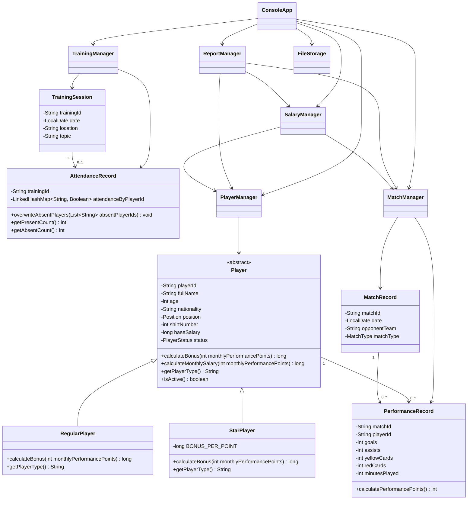

# Class Diagram

```mermaid
classDiagram
    class Player {
        <<abstract>>
        -String playerId
        -String fullName
        -int age
        -String nationality
        -Position position
        -int shirtNumber
        -long baseSalary
        -PlayerStatus status
        +calculateBonus(int monthlyPerformancePoints) long
        +calculateMonthlySalary(int monthlyPerformancePoints) long
        +getPlayerType() String
        +isActive() boolean
    }

    class RegularPlayer {
        +calculateBonus(int monthlyPerformancePoints) long
        +getPlayerType() String
    }

    class StarPlayer {
        -long BONUS_PER_POINT
        +calculateBonus(int monthlyPerformancePoints) long
        +getPlayerType() String
    }

    class TrainingSession {
        -String trainingId
        -LocalDate date
        -String location
        -String topic
    }

    class AttendanceRecord {
        -String trainingId
        -LinkedHashMap~String, Boolean~ attendanceByPlayerId
        +overwriteAbsentPlayers(List~String~ absentPlayerIds) void
        +getPresentCount() int
        +getAbsentCount() int
    }

    class MatchRecord {
        -String matchId
        -LocalDate date
        -String opponentTeam
        -MatchType matchType
    }

    class PerformanceRecord {
        -String matchId
        -String playerId
        -int goals
        -int assists
        -int yellowCards
        -int redCards
        -int minutesPlayed
        +calculatePerformancePoints() int
    }

    class PlayerManager
    class TrainingManager
    class MatchManager
    class SalaryManager
    class ReportManager
    class FileStorage
    class ConsoleApp

    Player <|-- RegularPlayer
    Player <|-- StarPlayer
    TrainingSession "1" --> "0..1" AttendanceRecord
    MatchRecord "1" --> "0..*" PerformanceRecord
    Player "1" --> "0..*" PerformanceRecord
    PlayerManager --> Player
    TrainingManager --> TrainingSession
    TrainingManager --> AttendanceRecord
    MatchManager --> MatchRecord
    MatchManager --> PerformanceRecord
    SalaryManager --> PlayerManager
    SalaryManager --> MatchManager
    ReportManager --> PlayerManager
    ReportManager --> MatchManager
    ReportManager --> SalaryManager
    ConsoleApp --> PlayerManager
    ConsoleApp --> TrainingManager
    ConsoleApp --> MatchManager
    ConsoleApp --> SalaryManager
    ConsoleApp --> ReportManager
    ConsoleApp --> FileStorage
```
